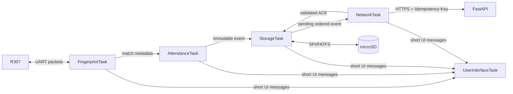
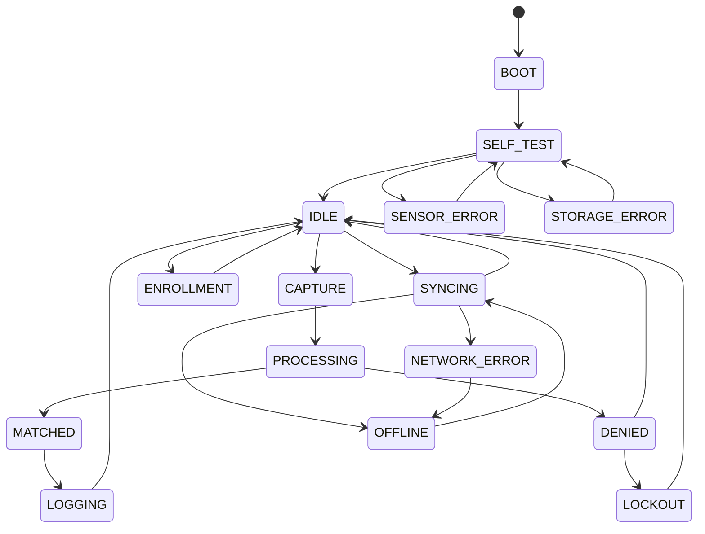

# BioSecure

[](https://github.com/OWNER/BioSecure/actions/workflows/ci.yml)

BioSecure is an engineering reference for an offline-first ESP32-S3 fingerprint
access/attendance device. It emphasizes protocol correctness, bounded concurrency,
durable metadata, recovery and explicit privacy limits—not a claim of a certified or
production-ready security product.

## What it demonstrates

- Direct R307 framing, checksum/ACK validation, timeouts and bounded retry in C++
- Explicit, host-tested state and attendance policy
- Five bounded FreeRTOS task queues; peripherals have single owners
- Append-first offline behavior, CRC recovery and ordered idempotent synchronization
- Wi-Fi/SNTP/HTTPS adapter boundaries and bounded exponential backoff
- Failed-attempt lockout and authorized enrollment boundaries
- FastAPI/SQLite demo API and failure-injectable host simulator
- No images, samples, features or biometric templates leave the R307

## Architecture



Authentication never waits for Wi-Fi: match → event → durable append → immediate
feedback; network work occurs independently. Bounded queues transfer values. The
fingerprint task alone owns UART/R307, storage alone owns FATFS, network alone owns
Wi-Fi/HTTP, and UI alone owns display/GPIO. Event bits announce connectivity, time
quality and storage readiness. Queue overflow increments a metric and fails safely;
it never silently claims persistence.



The exact allowed-transition table is in `components/core/state_machine.cpp`.

## Hardware and example wiring

Confirm voltage, current and pins for the actual boards before applying power.

| Device | Signal | ESP32-S3 example | Notes |
|---|---|---:|---|
| R307 | TX → RX | GPIO18 | 3.3 V UART logic; cross TX/RX |
| R307 | RX ← TX | GPIO17 | default 57600 8N1; confirm module |
| microSD | CS/SCK/MOSI/MISO | 10/12/11/13 | SPI; short wiring |
| OLED | SDA/SCL | 8/9 | I2C address commonly 0x3C |
| LED | signal | GPIO4 | series resistor required |
| buzzer | signal | GPIO5 | use transistor if current requires |
| all | GND | GND | common ground; size R307 supply correctly |

## R307 protocol

Wire format is `EF01 | address(4) | packet-id | length(2) | payload | checksum(2)`,
big-endian. Length includes checksum bytes. Checksum sums packet ID, both length bytes
and payload. The codec bounds payloads at 256 bytes; the driver rejects corrupt,
wrong-address, non-ACK and empty ACK packets and retries only to its configured limit.
Typed commands cover password verification, image capture/conversion, search, model
creation/storage/deletion and template count. There is deliberately no template
upload/download operation.

## Privacy, security and limitations

The R307 stores and matches templates. Events contain a sensor slot number, optional
application ID, result, UUID/sequence, device/firmware identity, timestamp and time
quality only. See [privacy](docs/BIOMETRIC_PRIVACY.md), [threat model](THREAT_MODEL.md)
and [presentation-attack limits](docs/PRESENTATION_ATTACK_LIMITATIONS.md). A SHA-256
chain is an optional tamper-evidence mechanism; hashing is not encryption and cannot
prevent deletion/rollback. The base R307 design makes no liveness/PAD claim.

Credentials are provisioned to encrypted NVS, never source or logs. The production
network adapter must use ESP-IDF HTTPS with certificate and hostname validation,
validate the ACK UUID, and send `Idempotency-Key: <event_uuid>`. Time is
`synchronized`, `estimated`, or `unknown`; an unsynchronized device does not invent
accurate UTC.

## Build and run

Prerequisites: ESP-IDF 5.1+ for firmware; CMake 3.16+, a C++17 compiler for host;
Python 3.11+ for backend.

```sh
# ESP-IDF terminal
idf.py set-target esp32s3
idf.py build
idf.py -p PORT flash monitor

# Host core/tests/simulator
cmake -S . -B build -G Ninja
cmake --build build
ctest --test-dir build --output-on-failure
./build/simulator/biosecure_sim --scenario happy
./build/simulator/biosecure_sim --scenario wifi-outage

# Backend
python -m venv .venv
# activate the venv, then:
pip install -r backend/requirements-dev.txt
python -m pytest backend/tests
uvicorn backend.app.main:app --reload
```

Docker alternative: `docker compose -f backend/compose.yaml up --build`. Interactive
API documentation is at `http://localhost:8000/docs`. Copy
`config/device.example.json` into the provisioning system; never add secrets to it.

Simulator scenarios: `happy`, `sensor-timeout`, `malformed-packet`, `wifi-outage`,
`backend-outage`, and `sd-failure`. Reboot recovery is covered by durable-log reload
tests; the simulator event file also supports manual kill/restart experiments.

## Failure handling

Sensor faults use deadlines and bounded retries, then a recoverable SENSOR_ERROR.
Unknown fingers are throttled and can trigger timed LOCKOUT. SD failure uses a bounded
emergency queue and explicit warning; success is shown only after durable acceptance.
Bad/truncated records are skipped/quarantined after the last valid record. Network
failure leaves ordered records pending and applies capped exponential backoff. See
the complete [failure matrix](docs/FAILURE_MODES.md).

## Instrumentation and benchmark method

Record monotonic start/end timestamps around authentication, UART transactions,
persistence, reconnect and synchronization. Export queue high-water marks, retry
counts, `esp_get_free_heap_size()`, each task's minimum stack watermark, and
`idf.py size` output. Run at least 100 warm and cold trials, retain distribution
percentiles and conditions, and avoid serial logging in timed regions.

| Metric | Method | Result |
|---|---|---|
| Authentication latency p50/p95/p99 | finger-ready to match outcome | PENDING HARDWARE VALIDATION |
| UART round trip p95 | write completion to valid ACK | PENDING HARDWARE VALIDATION |
| Persistence p95 | enqueue to flushed record | PENDING HARDWARE VALIDATION |
| Wi-Fi reconnect p95 | disconnect event to IP acquired | PENDING HARDWARE VALIDATION |
| Sync latency p95 | pending record to valid ACK | PENDING HARDWARE VALIDATION |
| Free heap / stack watermarks | ESP-IDF runtime APIs | PENDING HARDWARE VALIDATION |
| Firmware binary size | `idf.py size` | 1,326,436 bytes; 0x143dd0-byte image, 14% app-partition headroom |

No hardware measurements are fabricated. `CONFIG_BIOSECURE_BENCHMARK` should enable
machine-readable timings in a lab build without weakening privacy logging.

## Hardware test checklist

1. Verify supply voltage/current and common ground with the sensor disconnected.
2. Connect R307; verify password, template count, UART timeout and checksum-injection recovery.
3. Enroll two test fingers through authorized mode; power-cycle and verify slots remain in R307.
4. Confirm SD mount, append, remove/reinsert behavior, emergency-queue cap and drain.
5. Cut power during 100 append attempts; recover only complete records with monotonic sequences.
6. Authenticate with Wi-Fi disabled; confirm feedback follows local persistence within target latency.
7. Restore Wi-Fi; confirm ordered drain, correct TLS chain/hostname checks and matching ACK UUIDs.
8. Replay an event UUID; confirm one backend row and stable response.
9. Test duplicate scans just below, at and above the configured boundary.
10. Trigger consecutive failures; verify delay, lockout duration, UI and audit records.
11. Disconnect/reconnect R307 during capture; confirm no crash and self-test recovery.
12. Block the server and corrupt an ACK; verify bounded backoff and retained pending record.
13. Start without SNTP; confirm UNKNOWN, then ESTIMATED/SYNCHRONIZED transitions after sync.
14. Soak for 24 hours while sampling heap, task watermarks, queue depths and watchdog health.
15. Inspect SD, NVS, logs, API/database and packet traces: no images/features/templates.
16. Measure every benchmark row and record board, firmware, sensor, network and sample count.

## Current limitations and future work

Physical ESP32/R307 integration and measured timing require hardware. The checked-in
firmware includes task ownership/queue boundaries plus ESP-IDF UART, FATFS/SD,
OLED, Wi-Fi/SNTP and certificate-bundle HTTPS adapters. Pins, credentials and the
server URL are provisioned through project configuration and still require on-device validation.
Commercial work includes secure boot/flash encryption, signed OTA, secure element,
server-anchored audit hashes, supervised enrollment, PAD-capable multimodal hardware,
privacy retention tooling and destructive/EMC/environmental testing.

For design decisions and interview discussion, see [the interview guide](docs/INTERVIEW_GUIDE.md).

